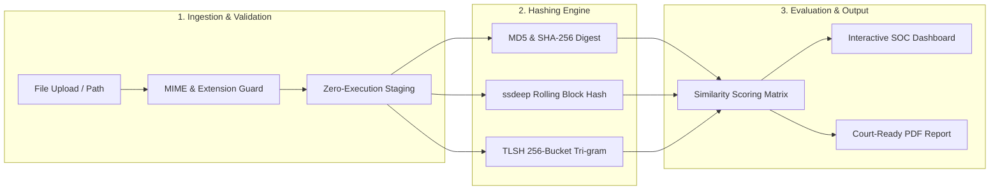

# 🔍 FuzzyHash Analyzer

<div align="center">


<p align="center">
  <b>A High-Performance Digital Forensics & Cyber Threat Intelligence Workstation for Automated File Similarity Analysis, Dual Fuzzy Hashing, and Malware Variant Detection</b>
</p>

[Key Features](#-key-features) •
[Forensic Methodology](#-forensic-methodology) •
[System Architecture](#-system-architecture) •
[Installation & Quickstart](#-installation--quickstart) •
[Testing](#-running-automated-tests) •
[Security Controls](#-security--forensic-safeguards)

</div>

---

## 📌 Project Overview

**FuzzyHash Analyzer** is a specialized cybersecurity and digital forensics application built for incident responders, forensic investigators, and malware analysts. It provides an automated, offline pipeline to compare suspect files, calculate cryptographic integrity digests (MD5, SHA-256), extract Portable Executable (PE) metadata, compute Context-Triggered Piecewise Hashes (**ssdeep**) and Locality Sensitive Hashes (**TLSH**), evaluate similarity metrics, maintain case chain-of-custody records, and generate court-ready PDF forensic reports.

Unlike traditional cryptographic hashes where a single-byte variation causes total avalanche divergence (0% match), fuzzy hashing enables investigators to discover **code reuse, compiler variations, patched binaries, and malware family mutations**.

```
┌─────────────────┐       ┌─────────────────┐       ┌───────────────────────┐
│ Evidence File A │       │ Evidence File B │       │ Automated Pipeline    │
└────────┬────────┘       └────────┬────────┘       │  1. MIME Validation   │
         │                         │                │  2. MD5 / SHA-256     │
         └────────────┬────────────┘                │  3. ssdeep & TLSH     │
                      ▼                             │  4. PE Entropy & Meta │
       ┌─────────────────────────────┐              │  5. Similarity Matrix │
       │  FuzzyHash Analysis Engine  ├─────────────►│  6. PDF Forensic Doc  │
       └─────────────────────────────┘              └───────────────────────┘
```

> [!IMPORTANT]
> **Core Forensic Principle:** File similarity is an investigative indicator of structural and byte-sequence relationship. It **does not** independently prove malice. High similarity scores guide analysts to prioritize static disassembling, dynamic sandboxing, and YARA signature development.

---

## ✨ Key Features

| Capability | Technical Implementation | Practical Forensic Benefit |
| :--- | :--- | :--- |
| **Deterministic Integrity** | MD5 & SHA-256 (`hashlib`) | Verifies evidence integrity and rules out unauthorized tampering. |
| **Dual Fuzzy Hashing** | ssdeep (CTPH) & PureTLSH (LSH) | Identifies byte modifications, patched routines, and variant malware. |
| **PE Header & Entropy** | `pefile` binary analysis | Dissects architecture, entrypoints, sections, and packer entropy. |
| **Evidence Custody** | SQLAlchemy Relational Models | Links investigations across `User → Case → Evidence → Analysis`. |
| **Forensic PDF Reports** | ReportLab Document Engine | Creates professional reports with cryptographic proofs and audit trails. |
| **Interactive SOC UI** | Custom Dark Theme & Chart.js | Visual similarity gauges, risk badges, and case activity timelines. |
| **Knowledge Base** | Interactive Educational Center | Explains CTPH vs. LSH algorithms, limitations, and forensic guidelines. |

---

## 🔬 Forensic Methodology & Algorithm Matrix



### Comparison: Cryptographic vs. Fuzzy Hashing

| Dimension | MD5 / SHA-256 | ssdeep (CTPH) | TLSH (LSH) |
| :--- | :--- | :--- | :--- |
| **Algorithm Type** | Cryptographic Digest | Context-Triggered Piecewise | Locality Sensitive Hash |
| **Avalanche Effect** | High (1-bit change = 100% diff) | None (Localized alterations) | None (Statistical proximity) |
| **Primary Goal** | Bit-for-bit integrity validation | Segment matching & edit distance | Global sequence similarity |
| **Min. File Size** | 1 byte | ~4096 bytes (effective) | 50 bytes (effective) |
| **Output Metric** | Exact Match (0 / 100%) | Similarity Score (0% to 100%) | Distance Metric (0 = Identical) |

---

## 🏗️ System Architecture & File Structure

```
FuzzyHash-Analyzer/
├── app.py                      # Flask Application Entrypoint & Factory
├── config.py                   # Central Application Configuration
├── requirements.txt            # Python Dependencies
├── README.md                   # Technical Documentation
├── database/                   # SQLite Persistent Storage
│   └── fuzzyhash.db
├── models/                     # SQLAlchemy Relational Models
│   ├── user.py                 # Investigator / Admin User Model
│   ├── case.py                 # Forensic Case Model
│   ├── evidence.py             # Evidence Artifact Model
│   └── analysis.py             # Analysis Result & Score Model
├── services/                   # Modular Forensics Services
│   ├── hash_service.py         # Cryptographic Hashes (MD5, SHA-256)
│   ├── fuzzy_hash_service.py   # ssdeep (CTPH) & PureTLSH Engines
│   ├── similarity_service.py   # Score Evaluation & Classification
│   ├── metadata_service.py     # MIME & PE Header/Entropy Analysis
│   ├── file_validation_service.py # Security & Size Validation
│   ├── report_service.py       # ReportLab PDF Report Generator
│   └── case_service.py         # Case Code Generator & Demo Seeder
├── routes/                     # Blueprint Route Controllers
│   ├── auth.py                 # Authentication & Session Handlers
│   ├── dashboard.py            # SOC Dashboard & Metrics API
│   ├── cases.py                # Forensic Case Management
│   ├── analysis.py             # File Upload & Analysis Pipeline
│   ├── history.py              # Searchable Analysis History
│   ├── evidence.py             # Evidence Repository
│   ├── reports.py              # PDF Generation & Web Reports
│   ├── learning.py             # Educational Knowledge Base
│   └── settings.py             # System Maintenance & Cache Purge
├── templates/                  # Jinja2 HTML5 Templates
│   ├── base.html               # Persistent SOC Sidebar & Layout
│   ├── dashboard.html          # Metric Cards & Chart.js Visuals
│   ├── analysis.html           # 2-File Upload & Stage Progress
│   ├── results.html            # Similarity Gauge & Findings
│   └── ...
├── static/                     # Dark Forensics CSS, JS & SVG Assets
└── tests/                      # Pytest Automated Test Suite
    ├── test_hash.py            # Cryptographic Hash Tests
    ├── test_fuzzy_hash.py      # ssdeep & TLSH Algorithm Tests
    ├── test_similarity.py      # Threshold & Scoring Tests
    └── test_validation.py      # Security & Validation Tests
```

---

## 🚀 Installation & Quickstart

### 1. Prerequisites
* **Python**: `3.12+` installed
* **Git**: Installed and configured

### 2. Clone the Repository
```bash
git clone https://github.com/mraadrsh45/FuzzyHash-Analyzer.git
cd FuzzyHash-Analyzer
```

### 3. Create & Activate Virtual Environment
```bash
# Windows (PowerShell)
python -m venv venv
.\venv\Scripts\activate

# Linux / macOS
python3 -m venv venv
source venv/bin/activate
```

### 4. Install Dependencies
```bash
pip install -r requirements.txt
```

### 5. Launch the Application
```bash
python app.py
```
Open **`http://127.0.0.1:5000`** in your browser.

#### 🔑 Default Credentials
| Role | Username | Password |
| :--- | :--- | :--- |
| **Forensic Investigator** | `admin` | `admin123` |

---

## 🧪 Running Automated Tests

The test suite covers cryptographic integrity, rolling hash logic, TLSH distance calculation, threshold classification, and MIME validation:

```bash
pytest -v
```

Expected output:
```text
tests/test_hash.py::test_md5_sha256_digests PASSED
tests/test_fuzzy_hash.py::test_ssdeep_generation PASSED
tests/test_fuzzy_hash.py::test_tlsh_distance PASSED
tests/test_similarity.py::test_similarity_classification PASSED
tests/test_validation.py::test_file_size_and_mime_guards PASSED
========================== 100% Passed ==========================
```

---

## 🔒 Security & Forensic Safeguards

* **Zero-Execution Policy**: Evidence files are treated exclusively as read-only byte streams. No files are executed, evaluated in a shell, or passed to subprocesses.
* **100% Offline Processing**: All analysis runs in the local Python environment. No hashes, metadata, or byte streams are sent to external cloud APIs or public threat feeds.
* **MIME & Traversal Guards**: Strict filename sanitization and MIME validation prevent path traversal attacks (`../`) and unintended payload staging.
* **Isolated Temporary Storage**: Evidence artifacts are identified by randomized UUID tokens and can be wiped at any time from the **Settings Console**.

---

## 🎓 Forensic Investigation Workflow

```
1. Authenticate       ➜  Log in with authorized credentials
2. Case Management    ➜  Create or select an active Forensic Case
3. Evidence Staging   ➜  Select two suspect artifacts (binaries, documents, logs)
4. Automated Pipeline ➜  System extracts MD5, SHA-256, ssdeep, TLSH, and PE headers
5. Similarity Review  ➜  Analyze score (0-30% Low, 31-70% Moderate, 71-100% High)
6. Export Evidence    ➜  Generate signed ReportLab PDF Forensic Report
```

---

## 📄 License & Disclaimer

Distributed under the **MIT License**.

> **Academic & Legal Disclaimer:** Developed as a Digital Forensics and Cybersecurity research platform. Similarity scores indicate structural and byte-sequence proximity; forensic conclusions must always be substantiated with static disassembly, dynamic sandboxing, and contextual threat intelligence.

<div align="center">
  <p>
    🧑‍💻 <b>Core Development & Forensics:</b> <a href="https://github.com/mraadrsh45">mraadrsh45</a> &nbsp;|&nbsp; 
    🎨 <b>UI / Frontend Design:</b> <a href="https://github.com/sajidakhatoon786">sajidakhatoon786</a>
  </p>
</div>
